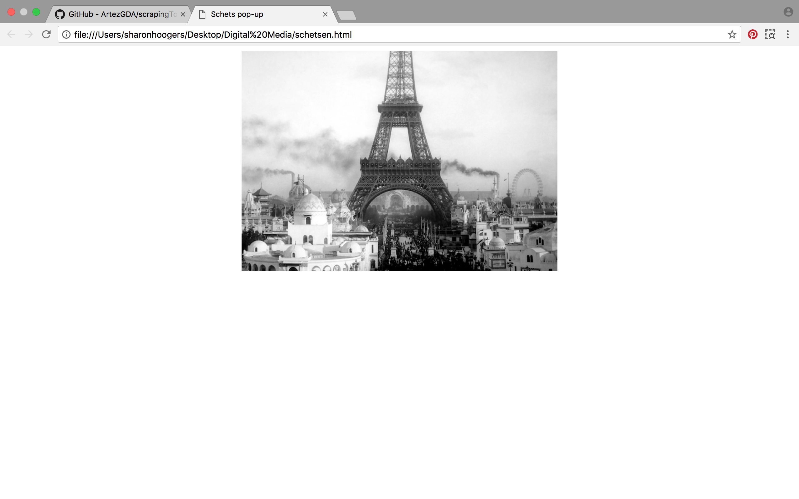
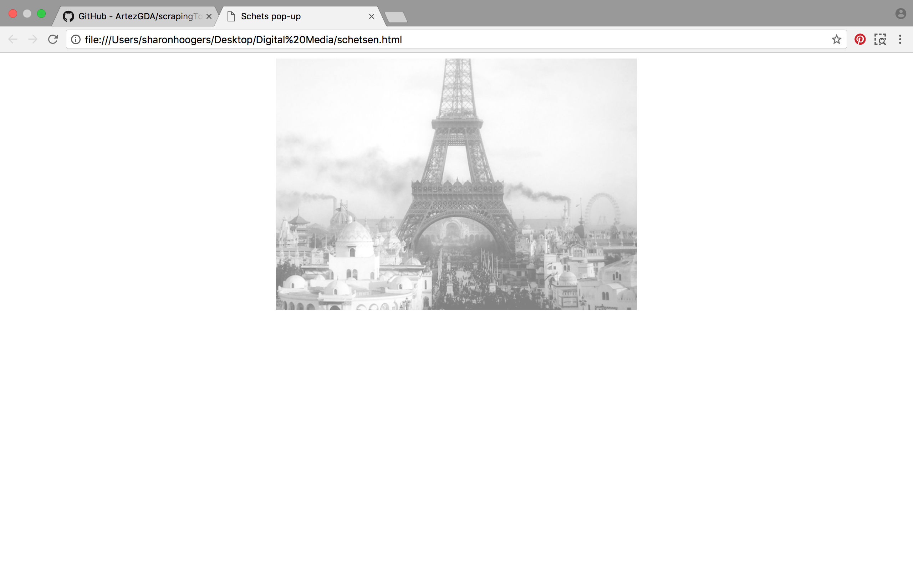
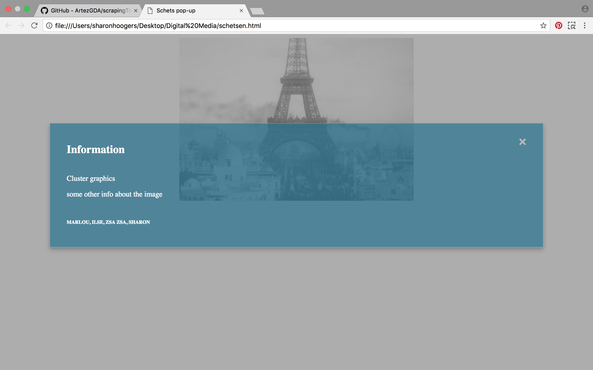
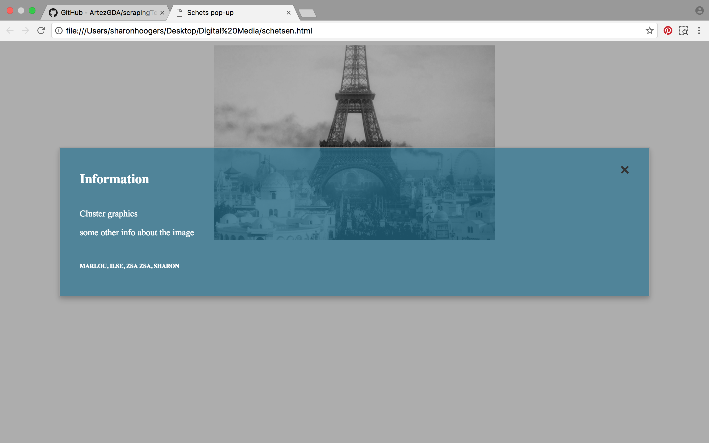

[]
[]
[]
[]

<!DOCTYPE html>
<html>
<head>
	<title>Schets pop-up</title>
	

</head>
<body>
	<!-- Trigger/Open The Modal -->
	
	<!-- <button id="myBtn">Open Modal</button> -->

	<!-- The Modal -->
	

  

    &times;
    <h2>Information</h2>
  

  

    
CLUSTER GRAPHICS

    
Bron: uk.reuters.com

    
First published: 11-03-2017

    
Author: Dylan Martinez

  

  

    <h6>MARLOU, ILSE, ZSA ZSA, SHARON</h6>
  

	
</body>
</html>
